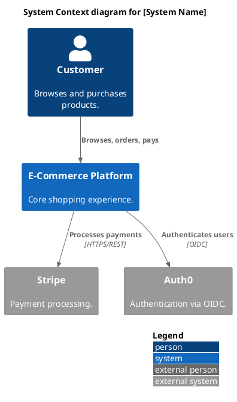
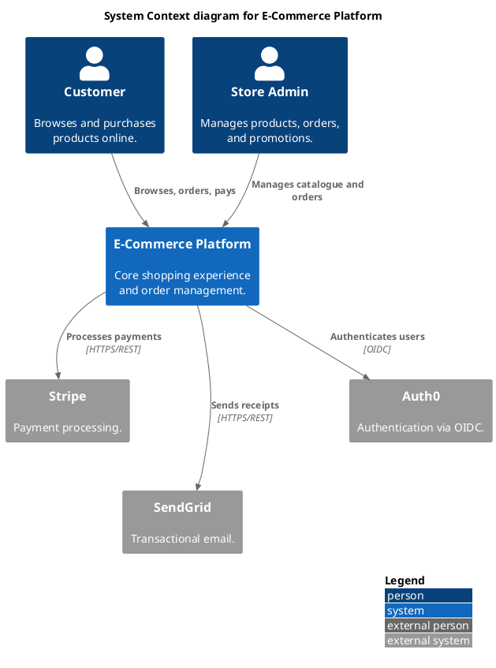
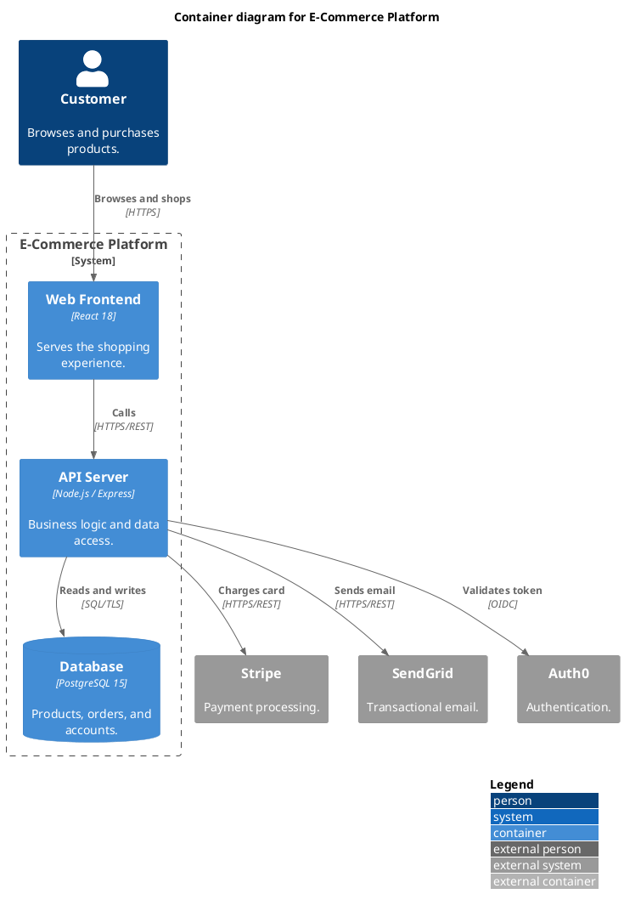

# C4 Diagram Skill

## Step 1: Understand what to diagram

**From conversation:** Diagram exactly what was described — don't add databases, queues, or other infrastructure that wasn't mentioned. If something seems architecturally missing, ask.

**From codebase or docs:** Read the relevant files to discover the real architecture before writing anything:
- `docker-compose.yml`, `kubernetes/`, `helm/` — services and relationships
- `README.md`, `docs/`, `architecture/` — stated intent
- `package.json`, `requirements.txt`, `go.mod` — external dependencies
- Config files, `.env.example`, `openapi.yaml` — integrations and APIs

**Updating an existing diagram:** Start from the current PlantUML code in context and apply the changes.

**Which level(s) to create:**

| Level | Include | Shows |
|-------|---------|-------|
| 1: Context | `C4_Context.puml` | System + external users and systems |
| 2: Container | `C4_Container.puml` | Apps, databases, queues inside the system |
| 3: Component | `C4_Component.puml` | Modules/services inside one container |

Default to Level 1 + Level 2 when not specified.

## Step 2: Write the PlantUML C4 code



**Argument counts:** `System`, `System_Ext`, `Person`, `Person_Ext` take **3 args**: `(alias, "Label", "Description")`. `Container`, `ContainerDb`, `ContainerQueue` and their `_Ext` variants take **4 args** including a technology field. Never pass `""` for a missing field — it garbles the output.

**Layout directives:**
- `LAYOUT_WITH_LEGEND()` — always include this
- `LAYOUT_LANDSCAPE()` — use when many elements need to spread horizontally
- `Lay_R(a, b)` — `a` left of `b`
- `Lay_D(a, b)` — `a` above `b`

Declare elements in reading order (users first, external systems last) and add `Lay_R`/`Lay_D` hints for any elements that still clump.

**Quality rules:**
- Only include what you can verify — from the conversation or from the code.
- If a service has a database that wasn't mentioned, note it in the service description rather than adding a node. Only draw it separately if it was explicitly called out or found in config files.
- Aim for ~12 elements per diagram, hard cap at 20 — split or go to the next C4 level if you need more.
- Use unidirectional arrows only (`Rel`, not `BiRel`) — bidirectional arrows obscure who initiates the interaction.
- Label relationships with action verbs and a technology: `"Sends order confirmation", "SMTP"` not `"uses"`.
- Use `_Ext` variants for everything outside the system boundary.
- Descriptions: one short sentence for a non-technical reader, under 50 characters where possible.
- For containers: always include the technology field.
- Use descriptive aliases — `orderService` not `s1`.

## Step 3: Render and inspect

Save to a `.puml` file, then render:

```python
python -c "
import base64, zlib, urllib.request, sys
src = open(sys.argv[1], 'r', encoding='utf-8').read()
enc = base64.urlsafe_b64encode(zlib.compress(src.encode('utf-8'), 9)).decode('ascii')
url = f'https://kroki.io/plantuml/png/{enc}'
req = urllib.request.Request(url, headers={'User-Agent': 'Mozilla/5.0'})
with urllib.request.urlopen(req) as r, open(sys.argv[2], 'wb') as f:
    f.write(r.read())
" c4_context.puml c4_context.png
```

View the PNG with your Read tool and check for:
- Overlapping labels or arrows
- Elements clumped in one area
- Uncrossable arrow paths
- Truncated text

| Problem | Fix |
|---------|-----|
| Labels overlap | Add `Lay_R(a, b)` to push elements apart |
| Everything vertical | Add `LAYOUT_LANDSCAPE()` |
| Arrows cross | Reorder declarations; add more `Lay_` hints |
| Too crowded | Remove least important elements or mention them in descriptions |

Iterate until clean.

## Step 4: Save and summarize

Save files to `docs/architecture/` if the project has a `docs/` folder, otherwise the current working directory. Use this naming convention:

| Diagram | Files |
|---------|-------|
| System context | `c4-context.puml` + `c4-context.png` |
| Containers | `c4-containers.puml` + `c4-containers.png` |
| Components (per feature) | `c4-components-{feature}.puml` + `.png` |
| Deployment | `c4-deployment.puml` + `c4-deployment.png` |
| Dynamic flow | `c4-dynamic-{flow}.puml` + `.png` |

To embed a diagram in GitHub markdown, add this to the relevant README or doc:
```markdown

```

Tell the user where the files are saved and give one sentence per diagram describing what it shows.

## Reference: Level 1 example



## Reference: Level 2 example


